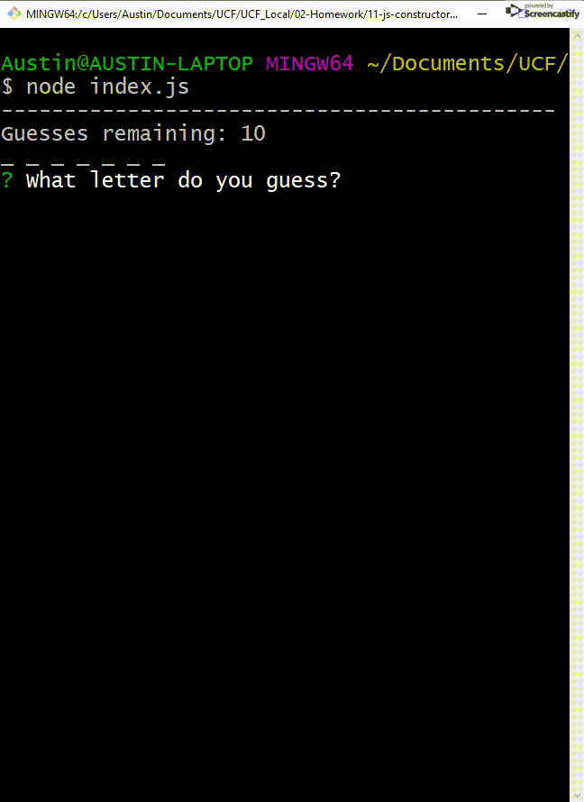

# Pokemon-Word-Guess

This application is a word guess game. It was designed with classes and constructor functions.

To play simply run the index.js file and the prompt will load up with your word.

You can either guess one letter at a time, or take a ris and guess the whole word!

If you correctly guess the word the game will ask you if you'd like a new word. If yes, the new word will load up just like the first.

To get the code setup just download the repo and run 'npm install' to get the neccesary modules. Afterward run the index.js file with node.
